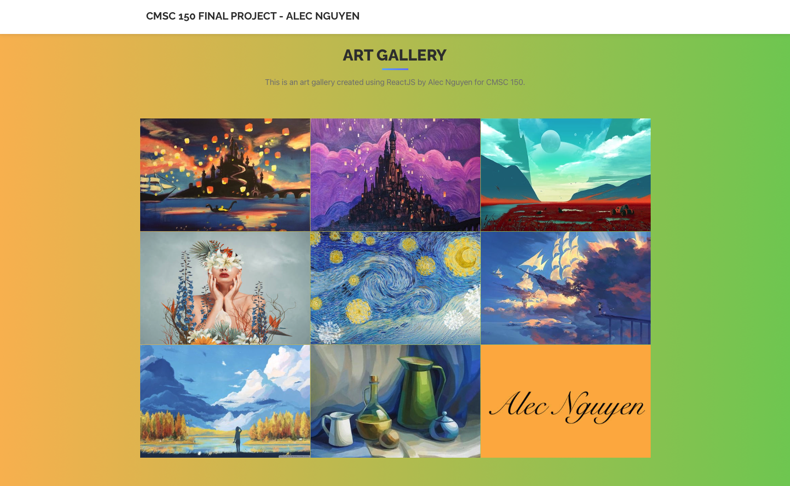

# CMSC 150 Final Project - Alec Nguyen

## Art Gallery
This is a ReactJS based art gallery, fit for hosting art pieces, static photos (.png, .jpeg, etc) or dynamic photos (.gif), with a one page view. All showcase slots can be easily updated by changing the data.json file.

## Make your own gallery
### 1. Setup
install <a href="https://nodejs.org/">Node JS</a> on your computer. 

### 2. Clone repo
After cloning the repo, run ```npm install``` and then ```npm start``` in the terminal on your VS Code.

### 3. Add your own art pieces
Update the data in the ```data.json``` file, as well as, add images to ```public/img/```.

### 4. Have fun


